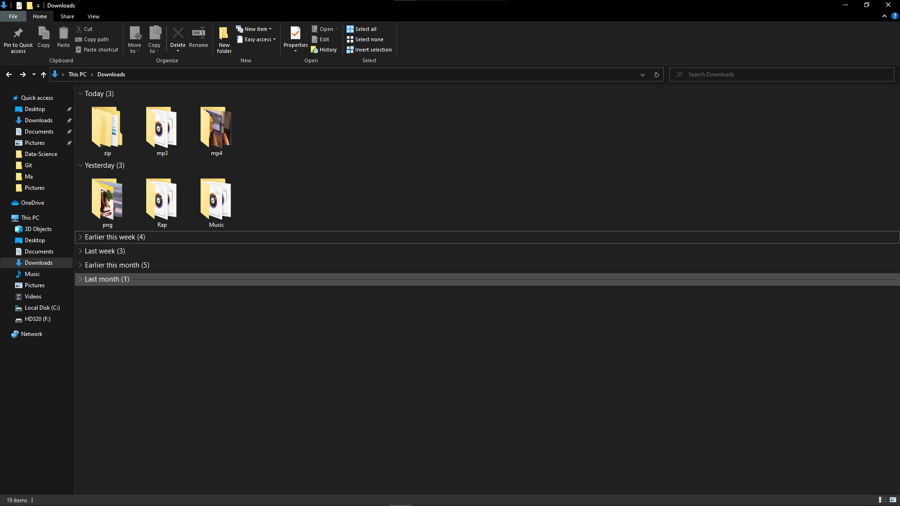

# Downloads-Folder-Organizer
An automation script that organizes all your downloaded files in separated folders according to its type.
To run it just change the path to your folder and double click on it

## Usage

If running for the first time install the modules:

`pip install -r requirements.txt`

Then:

`python automation.py <directory_to_be_sorted_path>`

**Example**:
    `"python ./src/file_organizer.py C:/Users/MyUser/Downloads>"`

